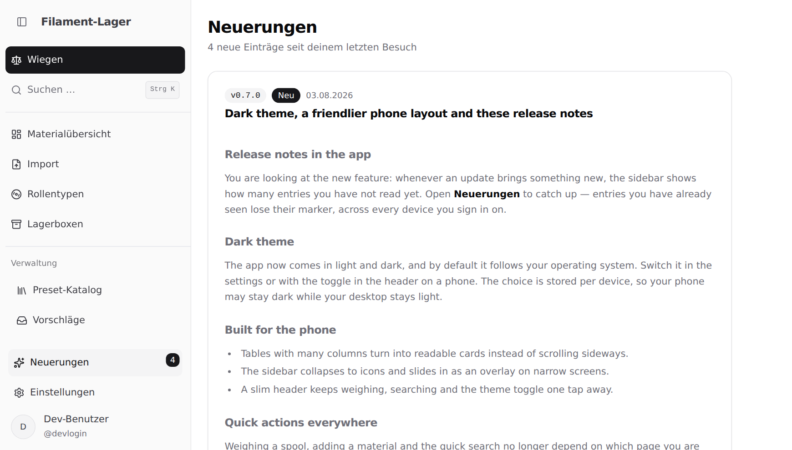

# Release Notes

Die Dateien in diesem Verzeichnis werden in der App unter „Neuerungen"
(`/neuerungen`) angezeigt. Sie sind Inhalt, kein Code.

## Sprache: ausschließlich Englisch

**Das ist die einzige Ausnahme von der Deutsch-Regel des Projekts**
(`AGENTS.md` im Wurzelverzeichnis, Abschnitt „Code-Stil").

- Release Notes werden **immer auf Englisch** geschrieben.
- Sie werden **nie** übersetzt, lokalisiert oder zweisprachig gepflegt. Es gibt
  keine `_de`-Varianten und keine Übersetzungsdateien.
- Die Oberfläche drumherum (Seitentitel, Menüeintrag, „Neu"-Markierung) bleibt
  deutsch – nur der Inhalt dieser Dateien ist englisch.

## Eine Datei pro Version

```
release_v<major>.<minor>.<patch>.md
```

- Die Version kommt **aus dem Dateinamen** – sie steht bewusst nirgends sonst,
  damit sie nicht auseinanderlaufen kann.
- Nur `X.Y.Z` mit reinen Zahlen ohne führende Nullen. Vorabversionen
  (`0.8.0-rc.1`) und Build-Metadaten werden abgelehnt.
- `AGENTS.md` (diese Datei) ist die einzige `.md`-Datei hier, die keine Release
  Note ist.

## Frontmatter

Pflicht, ganz am Dateianfang, beide Felder:

```markdown
---
date: 2026-08-03
title: Dark theme and release notes
---
```

- `date`: Veröffentlichungsdatum als `YYYY-MM-DD`.
- `title`: kurze englische Überschrift, ohne Versionsnummer (die zeigt die App
  daneben schon an).
- **Keine weiteren Schlüssel.** Unbekannte Felder – auch Tippfehler wie
  `titel:` – lassen die Seite in der Entwicklung leer bleiben (Grund samt
  Dateiname in der Browser-Konsole) und `npm run test` fehlschlagen.
  `version:` ist ebenfalls verboten (siehe oben).

## Inhalt: ausschließlich für Endbenutzer

Die Zielgruppe ist **eine einzige**: jemand, der die App benutzt und sie weder
betreibt noch verwaltet noch entwickelt. Hinein gehören **neue Funktionen,
spürbare Verbesserungen und behobene Fehler** – und sonst nichts.

**Die Prüffrage für jeden Satz:** Ergibt er für jemanden Sinn, der die App nur
benutzt – der also keinen Server aufsetzt, keine Umgebungsvariable kennt, keine
Verwaltungsseite sieht und den Quelltext nie öffnet? Wenn nein: streichen. Nicht
umformulieren, nicht in einen Nebensatz retten – streichen.

Was damit **nicht** in eine Release Note gehört:

| Nicht hinein                | Beispiele                                                                                                                                            |
| --------------------------- | ---------------------------------------------------------------------------------------------------------------------------------------------------- |
| **Für Hoster**              | Umgebungsvariablen, Docker, Deployment, Datenbank-URLs, Migrationen, Upgrade-Hinweise, „Set X before you upgrade"                                    |
| **Für Administratoren**     | die Verwaltungsseiten, Moderation, Katalogpflege, Systemzustand, Rollen                                                                              |
| **Technischer Hintergrund** | Tabellen- und Spaltennamen, Dateinamen, Funktionsnamen, Commit-Hashes, Schema-Änderungen, „auf dem Server gerechnet", „es gibt keine Fremdschlüssel" |
| **Entwicklungsvorgang**     | Tests, Prüfungen, Refactorings, Versionsnummern von Formaten, interne Umbauten                                                                       |

Es gibt **keinen** Abschnitt „For operators", „Für Administratoren" oder
Ähnliches. Was Betreiber wissen müssen, steht in `README.md`, `PRIVACY.md` und
`COMPLIANCE.md`; was Entwickler wissen müssen, in `AGENTS.md` und im Quelltext.
Beides erreicht seine Leser dort – und niemanden, der es nicht braucht.

**Das Warum darf bleiben, solange es der Benutzer nachvollziehen kann.** „Powder
gets no second unit, because bulk density depends on grain size and a wrong
number is worse than none" erklärt eine Entscheidung, die er sieht. „Die
Zweitanzeige rechnet der Server, weil die Projektion sonst zwei Felder mehr
herausgeben müsste" erklärt eine, die ihn nichts angeht.

**Eine Datenschutz-Aussage ist Benutzerinhalt**, kein Hoster-Thema: Wer was von
ihm zu sehen bekommt und was nie hinausgeht, betrifft ihn unmittelbar. Der Weg
dorthin (Projektion, Spaltenauswahl) nicht.

**Wenn nach dieser Regel nichts übrig bleibt**, ist die Release Note eine kurze
Wartungsnotiz – zwei Zeilen, die sagen, dass sich für den Benutzer nichts
geändert hat (Vorbild: `release_v1.0.0.md`, `release_v2.0.1.md`). Die Datei
entfällt **nicht**: Eine Lücke in der Versionsliste wirft mehr Fragen auf, als
sie erspart.

## Form

- Beginne die Abschnitte bei `##` (`#` ist der Seite vorbehalten).
- Unterstützt sind Überschriften, Absätze, Listen, Fett/Kursiv, Links, Code,
  Tabellen (GitHub-Markdown) und Bilder.
- **Kein rohes HTML** – es wird beim Rendern still verworfen und ist deshalb
  durch einen Test verboten.
- **Keine Tailwind-Klassen.** Tailwind durchsucht `.md`-Dateien nicht; die
  Gestaltung kommt vollständig aus `src/components/ReleaseNoteMarkdown.tsx`.

## Bilder

- Ablageort: `images/`, Dateiname mit Versionspräfix und in Kleinbuchstaben,
  z. B. `images/v0.7.0-release-notes.png`.
- Referenz relativ zu diesem Verzeichnis:

  ```markdown
  
  ```

- **Alternativtext ist Pflicht** (englisch), sonst schlägt der Test fehl.
- Bilder werden über `import.meta.glob` mitgebaut und landen gehasht in
  `dist/public/assets/`. Ein Verweis auf eine nicht vorhandene Datei und ein
  Bild, auf das keine Release Note verweist, lassen beide die Tests
  fehlschlagen.

## Beim Veröffentlichen

1. Version in `package.json` erhöhen.
2. Passende `release_vX.Y.Z.md` in **derselben Änderung** anlegen.
3. `npm run test` – `api/releaseNotes.test.ts` prüft Namen, Frontmatter,
   Bildverweise und Alternativtexte gegen die echten Dateien.

## Veröffentlichte Einträge nicht mehr umschreiben

Benutzer haben sie unter Umständen schon als gelesen markiert und sehen eine
Änderung nie wieder. Tippfehler und Formulierungen zu korrigieren ist in
Ordnung; nachträglich Inhalte **ergänzen** gehört in die nächste Version.

Zwei Ausnahmen, beide aus demselben Grund – wer den Eintrag schon gelesen hat,
verpasst dadurch nichts:

- **Etwas entfernen, das nach der Regel oben nie hineingehört hätte.** Der
  Bestand wurde in 2.4.0 einmal danach durchgesehen.
- **Eine sachlich falsche Aussage berichtigen.** In `release_v2.0.0.md` stand,
  der Datenexport sei „the same format the import page reads" – die Importseite
  liest ein anderes. Eine Zusage, die die App nicht einlöst, stehen zu lassen
  wäre schlechter, als sie zu berichtigen.

`npm run format` (Prettier) formatiert diese Dateien mit – Aufzählungen mit
`-`, Absätze werden nicht neu umbrochen.
