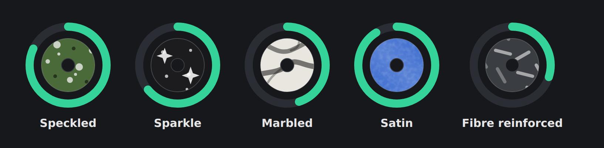

## Four new finishes

Stone, galaxy and glitter filaments now look like themselves in the shelf, on
the tiles and on every material page:

| Finish       | For                                                                                           |
| ------------ | --------------------------------------------------------------------------------------------- |
| **Speckled** | Stone fills, granite, terrazzo and anything with specks in it – dark and light specks at once |
| **Sparkle**  | Glitter, galaxy and starlight filaments                                                       |
| **Marbled**  | Marble filaments with veins in a second colour                                                |
| **Satin**    | The soft sheen between matte and silk                                                         |

Type the finish as you know it – “Stonefill”, “Galaxy”, “Glitter”, “Marble”,
“Terrazzo”, “Satin” and many more are recognised in German and English. The
suggestions in the material form include the new finishes, and your own
finishes under **Colours & finishes** can use them too.

## Carbon is now “Fibre reinforced”

Carbon fibre is only one kind of reinforcement. Glass, aramid (Kevlar), basalt
and aluminium fibres look the same on a spool, so they now share one finish:
**Fibre reinforced**, drawn as short fibres instead of a woven pattern.
Everything you entered as “Carbon” or “CF” keeps being recognised, and your own
finishes that used carbon now use the new one – you don't need to change
anything.

## More names that are recognised

- “Pearl” and “Perlmutt” show as silk, “Translucent” and “Crystal” as
  transparent, “Cork” and “Bamboo” as wood.
- **“Seidenmatt”** now shows as satin instead of matte – it is the German word
  for exactly that finish.
