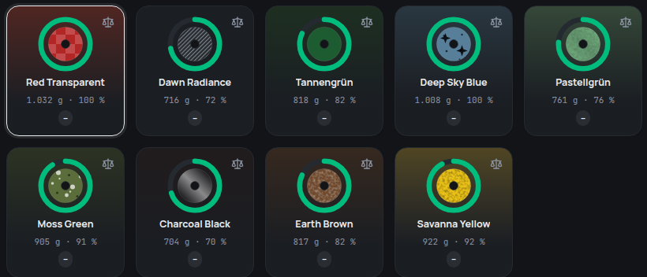

## Colours from their names

Most filament colours are a picture plus a colour word – “Savanna Yellow”,
“Earth Brown”, “Charcoal Black”, “Tannengrün”. Until now, filahub only knew
the plain colour names and showed anything else as a hatched field. It now
finds the colour word inside the name and shows the colour right away, in the
shelf, on the tiles and in every list:

- **About 150 colour names** in German and English are known now – from
  Charcoal, Nardo Grey and Terracotta to Petrol, Salbei and Himmelblau.
- **The longest match wins:** “Matte Dark Green” shows dark green, not just
  green.
- **Light and dark words count:** “Pastel Pink” is lighter than pink, “Deep
  Purple” darker than purple.
- **German compound words work too:** “Abendrot” is red, “Dunkeltürkis” a
  darker turquoise.
- **Descriptions don't get in the way:** “Red Transparent” is red, not clear.

A name without any colour word – “Dawn Radiance”, say – stays hatched, as
before. filahub never makes up a colour from a name.

## Make it exact

A colour found this way is close, not exact. When you enter or edit a
material, the colour field says **“Recognised from ‘Yellow’ – the shade is
approximate”** and offers to set the exact colour. The colour picker starts
on the recognised shade; once you save it, that colour is used for every
material with this name.
