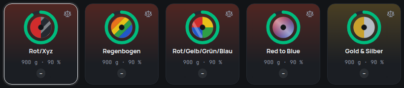

## More than one colour

Dual and tri-colour silk, quad-colour coextrusions, gradients and rainbow
spools now show all their colours – on the spool in the shelf, on the tiles
and in every list:

| Arrangement            | What it is                                                                            |
| ---------------------- | ------------------------------------------------------------------------------------- |
| **Multi-colour (2–4)** | The strand is split lengthwise – dual, tri, quad. Shown as halves, thirds or quarters |
| **Gradient**           | The colour changes smoothly along the strand                                          |
| **Segments**           | Hard changes in sections, like rainbow spools                                         |

## Straight from the name

You don't have to set anything up for the common cases. A colour name made of
several colours is shown that way right away:

- **“Red/Blue”**, **“Gold & Silver”**, **“Rot/Gelb/Grün/Blau”** – two to four
  colours are shown as a multi-colour spool, five or more as segments.
- **“Red to Blue”** or **“Blau zu Violett”** is a gradient.
- Words like **Dual**, **Tri**, **Quad**, **Gradient** or **Multicolor** in the
  colour or the finish decide the arrangement – “Gold/Silver” with the finish
  “Silk Dual” is a dual-colour spool.
- A part filahub doesn't know stays hatched: “Red/Xyz” shows red and a hatched
  part, instead of guessing.

## Set it up exactly

Under **Colours & finishes**, a colour of your own can now have up to four
colours in a spool's cross-section, or up to eight in a gradient or in
segments – each with its own name if you like. When you enter a material
whose colour was recognised from its name, **“Set exact colour”** opens the
same editor, already filled in with what filahub recognised.

## Colours for specks, glitter and veins

The speckled, sparkle and marbled finishes can now use real colours: set
**particle colours** on your colour – the dark and light specks of a stone
fill, the gold and silver glitter of a galaxy filament, the grey veins of a
marble. Without them, the patterns are drawn in black and white as before.
