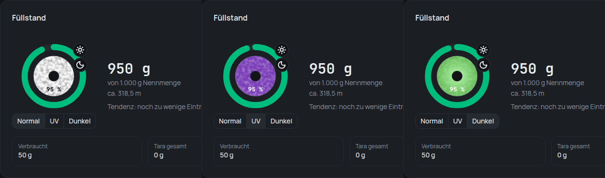

## Effects

A colour of your own can now say how it changes: under **UV or sunlight**, with
**heat** (optionally from a temperature), **in the dark**, under
**blacklight**, with the **viewing angle** (chameleon), or with **infrared**.
Add them under **Colours & finishes** when you create or edit a colour – each
with the colour it turns into and, if you like, a name for it.

## See them

Spools with an effect carry a small sign – a sun for UV, a thermometer for
heat, a moon for glow in the dark. On a spool's page and a material's page, a
switch shows the spool **Normal**, under **UV**, with **Heat**, in the
**Dark** or under **Blacklight**:

Chameleon colours show as a soft blend into their second colour everywhere,
because that is how they look on the shelf.

## Find them

The overview has a new **Effect** filter – “everything that glows in the
dark” is one click. It appears as soon as one of your materials has an effect.

## Neon and glow in the dark

- **Neon yellow, neon green, neon orange and neon pink** are recognised as
  colours that glow under blacklight.
- **“Glow green”** and **“glow blue”** are recognised as glow-in-the-dark
  colours – nearly white by day, glowing green or blue at night.
- **“Neon” as a finish no longer draws a glow.** Neon glows under blacklight,
  it does not glow in the dark – that was wrong until now. Use one of the neon
  colours instead.
