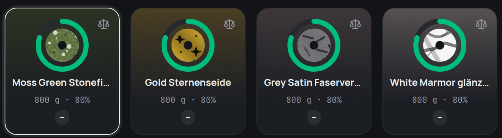

## Sheen and structure together

Many filaments are two finishes in one: glitter in a silk strand, a galaxy
filament with a matte surface, fibres under a satin sheen. Until now a spool
showed only one of them. Now it shows both – the **structure** inside the
strand (glitter, speckles, marble veins, fibres, wood grain) with the
**sheen** on top (matte, satin, silk, glossy, metallic, transparent):

## Recognised from the name

Finish names such as **“Silk Glitter”**, **“Matte Galaxy”**, **“Marmor
glänzend”** or **“Matt CF”** are now read part by part, in any order – there
is nothing to set up.

## Your own finishes

Under **Colours & finishes**, a finish of your own now has two fields:
**Sheen** and, optionally, **Structure**. The preview shows both, and the list
names both. Finishes you added before keep looking exactly as they did.
